# Controle de Salas de Reuniões - Projeto Full Stack

Este projeto é um sistema de gerenciamento de salas de reuniões desenvolvido como parte do desafio prático de desenvolvimento full stack. Ele combina a parte de **back-end**, desenvolvida em **Java com Spring Boot**, e o **front-end**, construído com **Angular**, permitindo a criação, atualização, listagem e exclusão de salas de reunião.

## Objetivos do Projeto

O objetivo do projeto foi criar um sistema funcional e escalável para controle de salas de reuniões, abrangendo tanto a interface do usuário (UI) quanto a lógica de negócios e persistência de dados. O projeto abrange:

- Criação e atualização de informações de salas de reunião.
- Visualização e exclusão de registros de reuniões.
- Integração entre front-end e back-end.
- Uso de banco de dados H2 para armazenamento de dados.

## Tecnologias Utilizadas

### Back-end

- **Java 17**: Linguagem principal para desenvolvimento do back-end.
- **Spring Boot 3.3.4**: Framework utilizado para criação da API Rest.
- **Spring Data JPA**: Gerenciamento de persistência com o banco de dados H2.
- **Hibernate Envers**: Controle de auditoria para versões de dados.
- **Lombok**: Redução de código boilerplate.
- **Swagger**: Documentação da API para facilitar o uso e testes.
- **Banco de Dados H2**: Banco de dados relacional embutido usado para testes.

### Front-end

- **Angular**: Framework utilizado para desenvolvimento da interface do usuário.
- **TypeScript**: Linguagem principal para o desenvolvimento no Angular.
- **Bootstrap**: Biblioteca para estilização de componentes e layout responsivo.

## Estrutura do Projeto

O projeto está estruturado da seguinte forma:

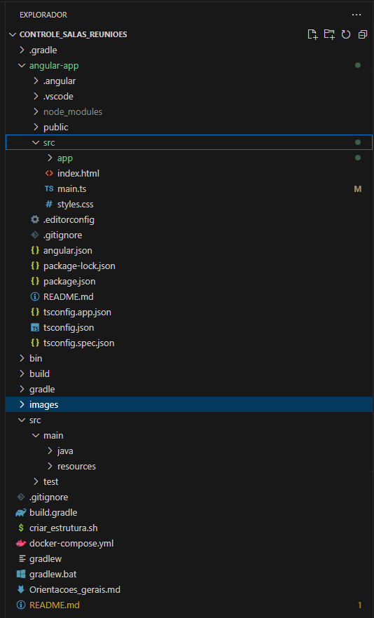

## Comandos Utilizados

### Backend

- Para construir o projeto back-end e rodar a API:

  mvn clean install
  mvn spring-boot:run

### Frontend

- Para rodar o projeto Angular:

  npm install
  ng serve

## Banco de Dados H2

Utilizamos o banco de dados H2 embutido para persistência de dados durante o desenvolvimento. O acesso ao console pode ser feito via URL:

    http://localhost:8080/h2-console

As credenciais para o banco H2 são configuradas no arquivo application.properties:

    spring.h2.console.enabled=true
    spring.datasource.url=jdbc:h2:mem:meetingdb
    spring.datasource.driverClassName=org.h2.Driver
    spring.datasource.username=sa
    spring.datasource.password=password
    spring.jpa.hibernate.ddl-auto=update

### Script SQL do Banco de Dados

O banco de dados H2 gera as tabelas automaticamente baseado nas entidades JPA do projeto. Abaixo está a estrutura SQL gerada:

    CREATE TABLE room (
        id BIGINT NOT NULL AUTO_INCREMENT PRIMARY KEY,
        name VARCHAR(255),
        date DATE,
        start_hour TIME,
        end_hour TIME
    );

## Imagens do Desenvolvimento

Durante o desenvolvimento do projeto, capturamos várias etapas importantes. Abaixo estão algumas imagens que mostram o processo.

### 1. Criando o projeto Angular

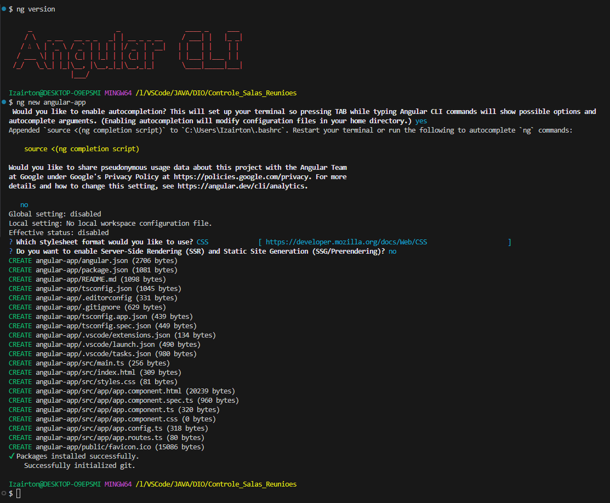

### 2. Script de Criação da Estrutura do Projeto

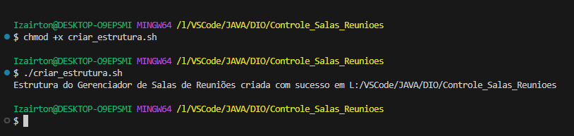

### 3. Conexão ao Console H2

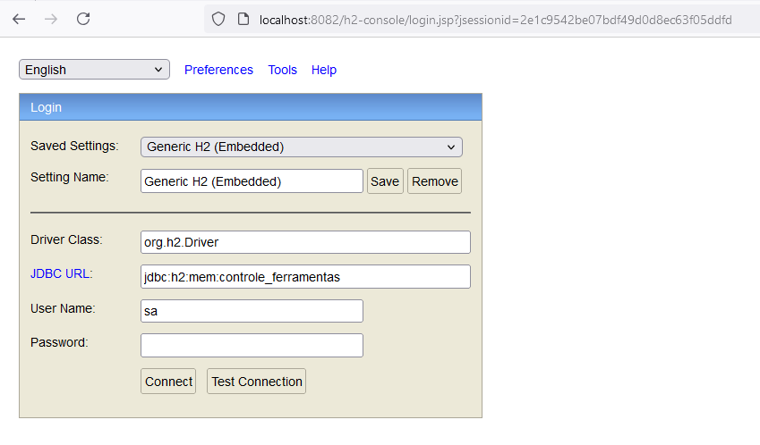

### 4. Construindo o Gradle Build

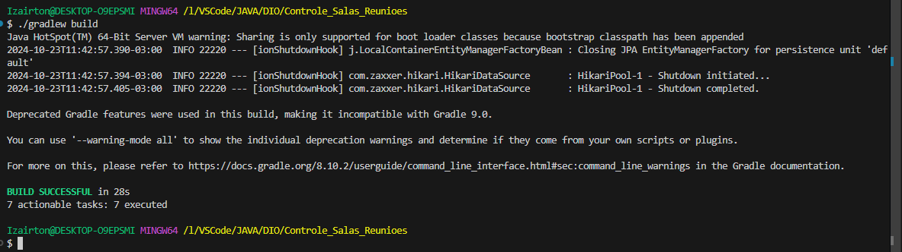

### 5. Construindo o Gradle Wrapper

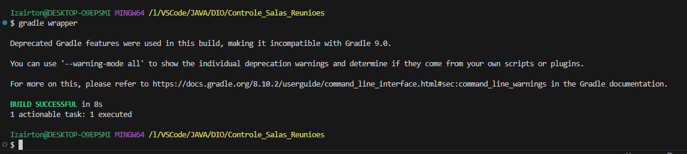

### 6. Executando o Gradle bootRun

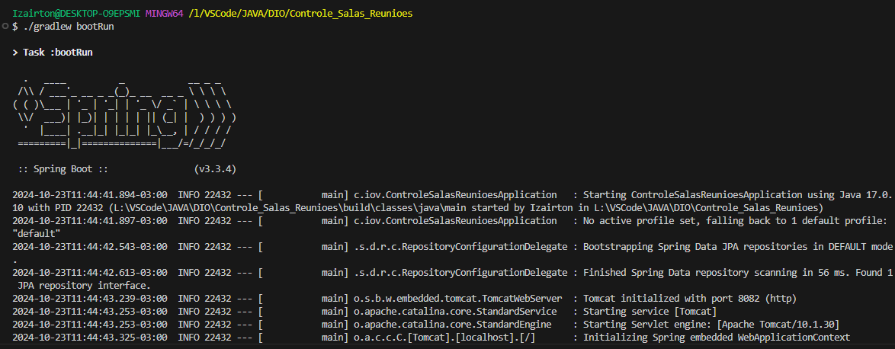

### 7. Gerando Componentes no Angular

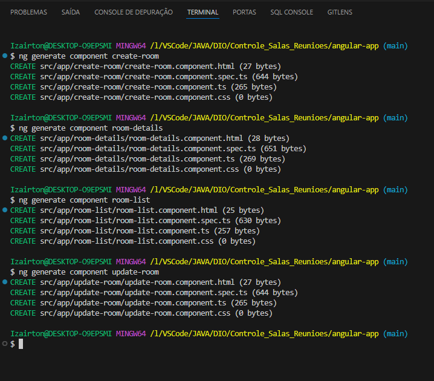

### 8. Instalação do Angular e Node.js

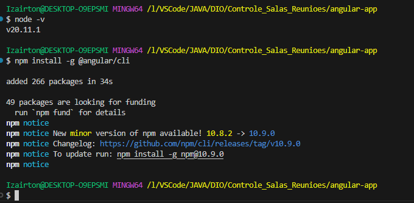

### 9. Limpando o Gradle Clean

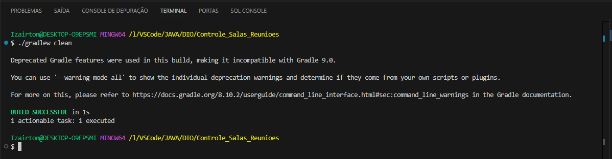

### 10. Consultando Sala com GET no Postman

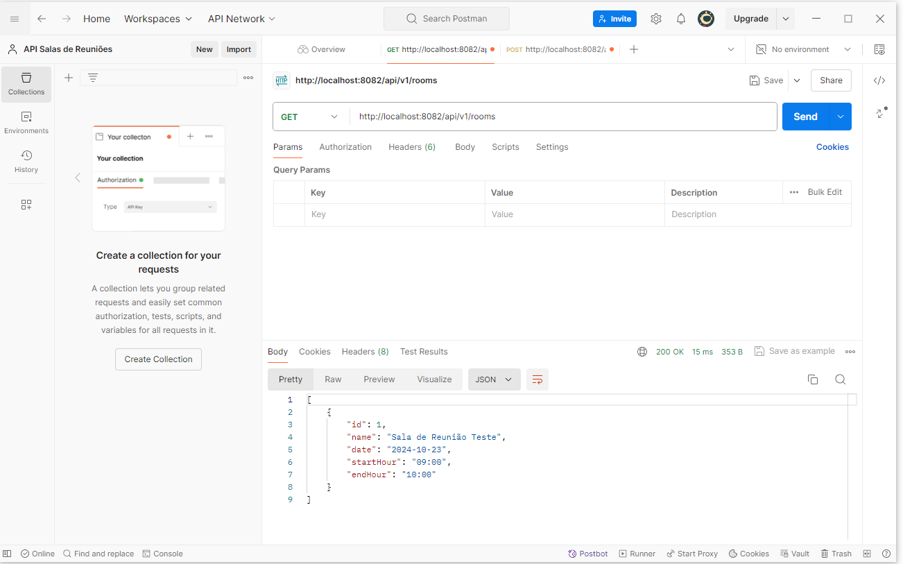

### 11. Criando Sala com POST no Postman

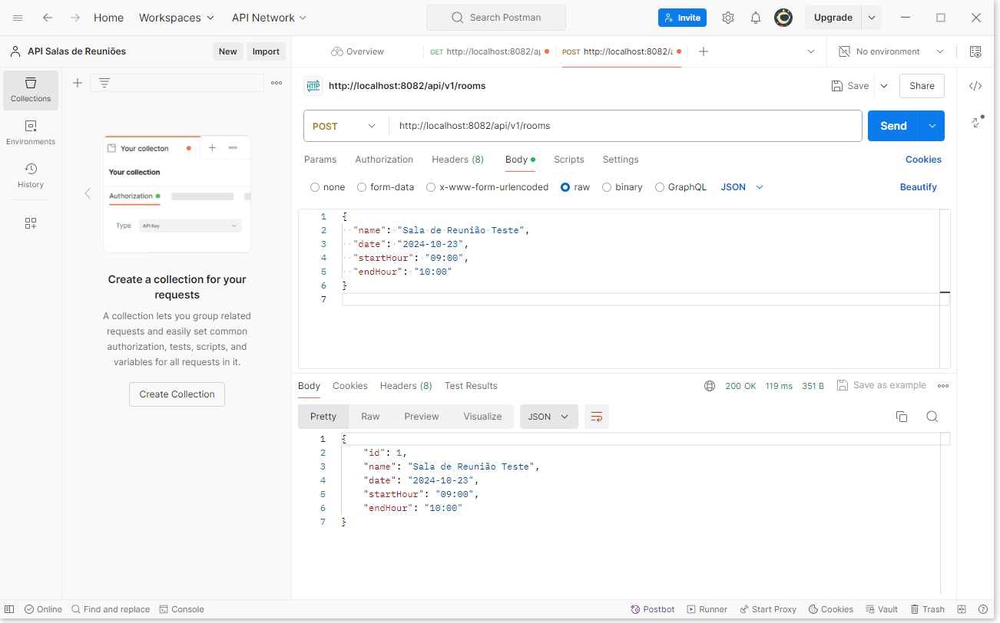

### 12. Rodando o Angular no Servidor 4200

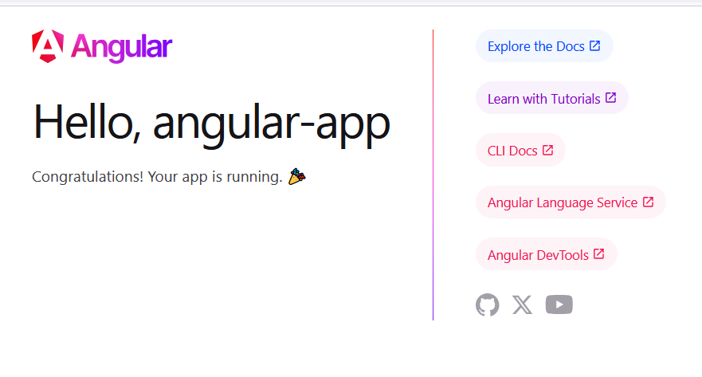

### 13. Rodando `ng serve` no Angular

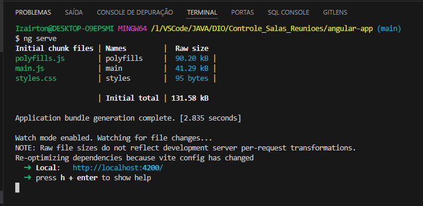

### 14. Rodando o Tomcat na porta 8082

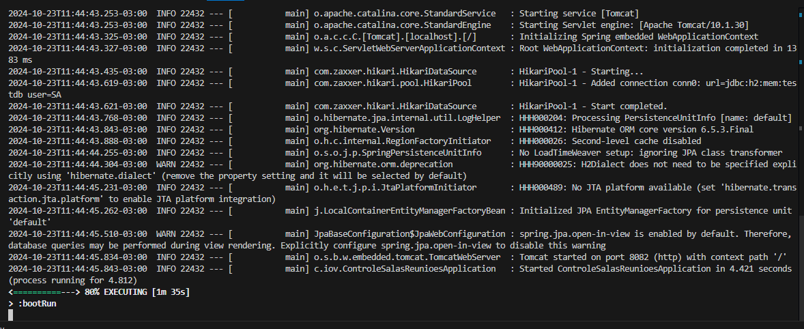

### 15. Servidor Angular Iniciado

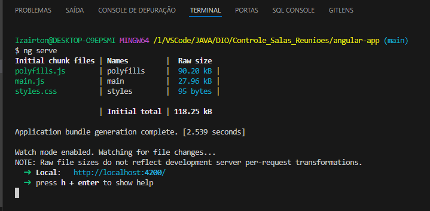

### 16. Tabela da Base de Dados TestDB no H2

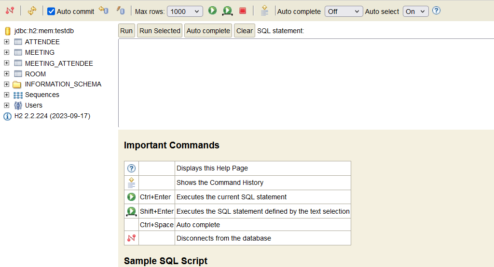

### 17. Versão do Angular

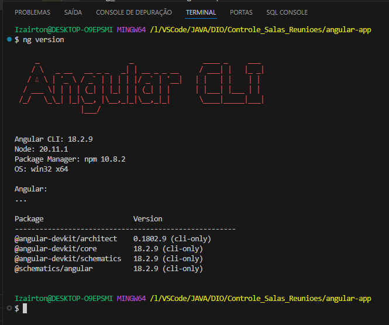

Essas imagens ilustram várias partes importantes do desenvolvimento, desde a criação do projeto até a execução e testes no Postman.

## Itens Relevantes

### Roteamento com Angular

O projeto faz uso do sistema de rotas do Angular para alternar entre diferentes visualizações, como criar, atualizar, listar e visualizar os detalhes das salas. O roteamento é configurado no arquivo app-routing.module.ts:

    const routes: Routes = [
    { path: '', redirectTo: 'rooms', pathMatch: 'full' },
    { path: 'rooms', component: RoomListComponent },
    { path: 'add', component: CreateRoomComponent },
    { path: 'details/:id', component: RoomDetailsComponent },
    { path: 'update/:id', component: UpdateRoomComponent }
    ];

### Comunicação entre Frontend e Backend

A comunicação entre o Angular e o Spring Boot é realizada por meio de chamadas HTTP via HttpClientModule no Angular, e o Spring Boot serve como API REST.

Exemplo de chamada no serviço Angular:

    getRoomsList(): Observable<Room[]> {
    return this.httpClient.get<Room[]>(`${this.baseUrl}`);
    }

### Componentes e Templates Angular

Cada funcionalidade de gerenciamento de sala foi dividida em componentes no Angular, permitindo modularidade e reusabilidade do código. Por exemplo, o componente room-list é responsável por exibir a lista de salas:

    <tr *ngFor="let room of rooms | async">
    <td>{{ room.name }}</td>
    <td>{{ room.date }}</td>
    <td>{{ room.startHour }}</td>
    <td>{{ room.endHour }}</td>
    </tr>

## Futuros Desenvolvimentos e Melhorias

- **Autenticação e Autorização:** Implementar autenticação de usuários, garantindo que somente pessoas autorizadas possam gerenciar as salas.
- **Validações Avançadas:** Adicionar validações de horário para garantir que não haja sobreposição de reuniões.
- **Envio de Notificações:** Incluir notificações por e-mail ou sistema de alerta para lembrar os usuários sobre suas reuniões.
- **Persistência em Banco Externo:** Migrar a persistência do H2 para um banco de dados externo como MySQL ou PostgreSQL para uso em produção.
- **Design Responsivo:** Refinar o design do front-end para garantir que seja totalmente responsivo e acessível em dispositivos móveis.
